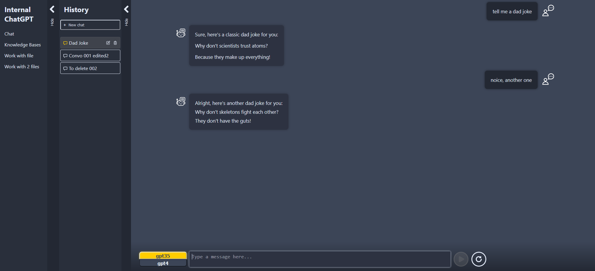
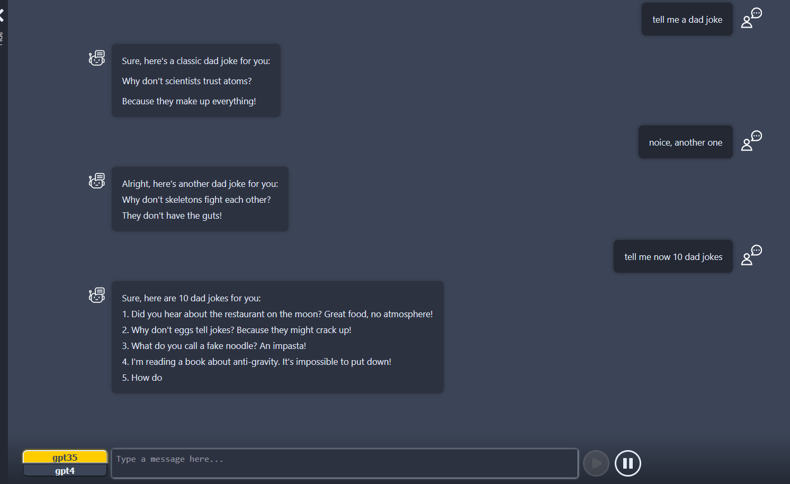
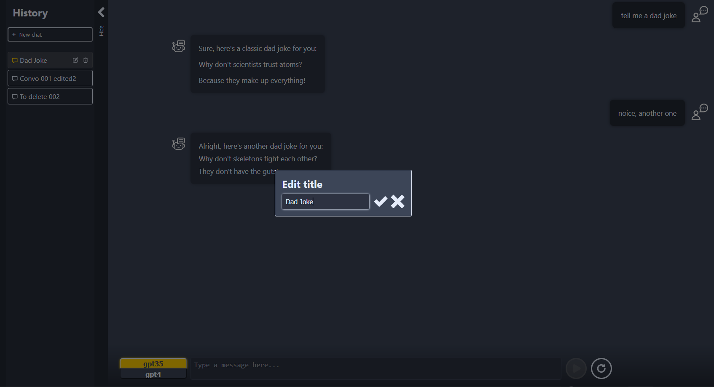
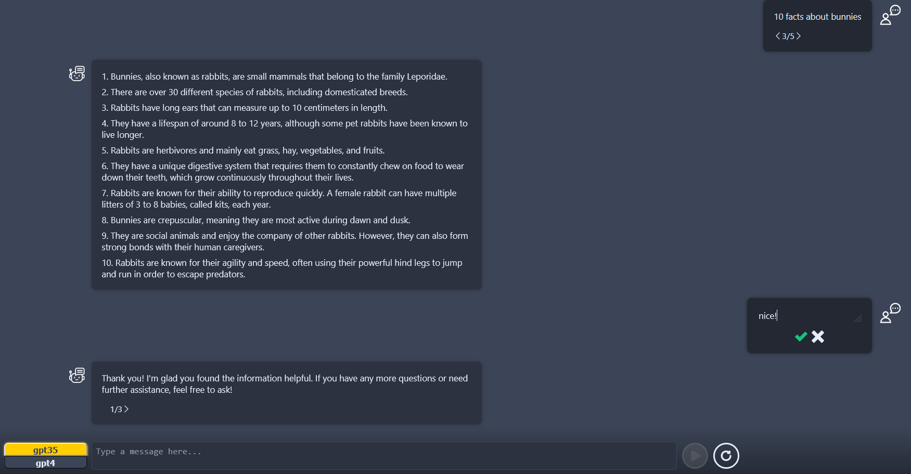
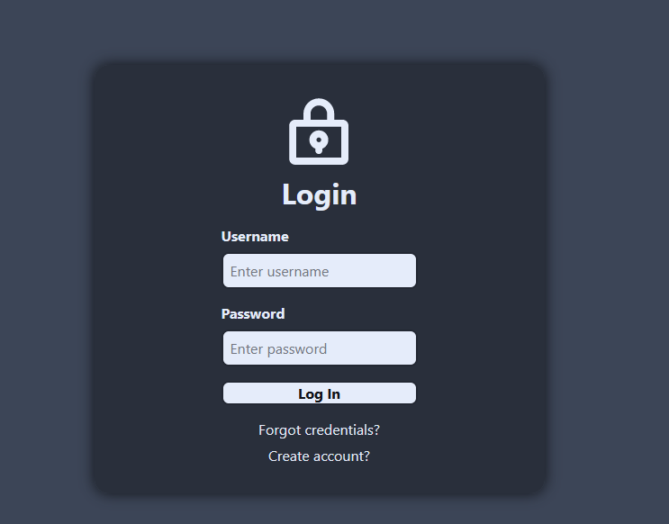
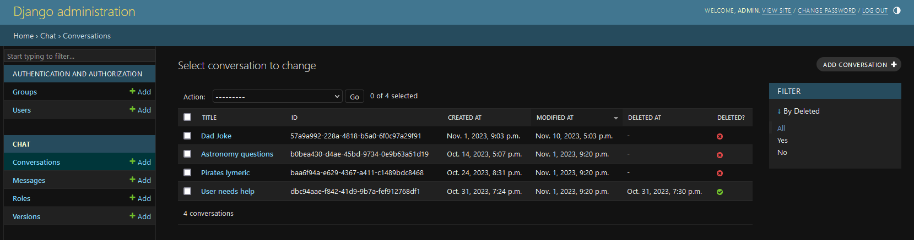

# Custom ChatGPT - work in progress

This project is a custom-built chatbot application that mimics the functionalities of ChatGPT for personal use. It's built using Python, Django for the backend, and React with Next.js for the frontend. The application provides regular chatting capabilities with history stored in the database, streaming responses, and auto-generated titles using gpt3.5. It also allows for title editing, conversation deletion, and messages regeneration. Project currently supports model selection between gpt3.5 and gpt4. It also features a custom Django admin page for managing conversations, versions, and messages.

It is a work in progress, with plans to add more features and functionalities.

The idea behind this project is to experiment with Next.js and create a personal version of ChatGPT with custom functionalities and features.

# Technologies

## Backend
- Python
- Django
- Django Rest Framework

## Frontend
- Next.js
- React

## Database
- SQLite for now -> will be changed to PostgreSQL

# Functionalities

- Regular chatting with history stored in DB as well as with different versions of conversation: while regenerating messages (or editing existing ones), the new version is created for given conversation
- Streaming responses
- Auto generated titles using gpt3.5
- Title edition for given conversation
- Deletion of given conversation
- Assistant messages regeneration
- User messages edition
- Models selection: currently gpt3.5 or gpt4
- Custom django admin page for managing conversations, versions and messages

# Images
## Main view

## Streaming

## Title edition

## Switching versions and editing messages

## Login page

## Admin page

# How to run this? (atm, docker-compose incoming)
- Backend:
  - Setup environment variables in `backend/.env` (create file if not exists):
    - `FRONTEND_URL` - url of frontend app - default: http://127.0.0.1:3000
    - `BACKEND_URL` - url of backend app - default: http://127.0.0.1:8000
    - `BE_ADMIN_USERNAME` - username for django admin page - default: admin
    - `BE_ADMIN_PASSWORD` - password for django admin page - default: admin
    - `DJANGO_SECRET_KEY` - django secret key
    - GPT part (currently set up for Azure endpoint):
      - `OPENAI_API_TYPE`: azure
      - `OPENAI_API_BASE`: your azure endpoint
      - `OPENAI_API_VERSION`: your azure api version
      - `OPENAI_API_KEY`: your azure api key
  - Create virtual environment and install requirements from `dependencies.txt`
  - Run `python manage.py makemigrations` and `python manage.py migrate`
  - Run `python manage.py create_superuser`
  - Run `python manage.py runserver`
- Frontend:
  - Setup environment variables in `frontend/.env.local` (create file if not exists):
    - `NEXT_PUBLIC_API_BASE_URL` - url of backend app - default: http://127.0.0.1:8000
  - Run `npm install`
  - Run `npm run dev`
- Go to `http://127.0.0.1:3000` and enjoy!

# ToDo:
- [ ] Dockerize: docker-compose for frontend, backend and db
- [ ] migrate to PostgreSQL
- [ ] add support for different LLMs:
  - [ ] Claude
  - [ ] LLaMa
- [x] add functionality for GUI to edit messages and switch between versions
- [ ] add RAG subpage
- [ ] add work with files subpage
- [x] add login & authorization for users
- [ ] add registration <- in progress
- [ ] add user chats separation
